

   

# GFT Quality Assurance Para Mulheres

O bootcamp ideal para pessoas que se identificam como mulheres e que estão buscando uma primeira oportunidade no mercado de TI, migração de carreira ou até mesmo júniores em busca de crescimento profissional e uma maior oportunidade na GFT. Com o objetivo de ensinar e graduar até mesmo quem nunca viu nada sobre o assunto, o bootcamp chegou para ser uma excelente porta de entrada para quem deseja aprender de verdade e construir uma carreira na área de Quality Assurance.

## **O dia a dia de um QA: A prática de testes manuais funcionais:**

### Projeto Prático

- Fluxograma unido o Processo de Teste com o Processo de Desenvolvimento de Software mostrando que assim que o processo de desenvolvimento do software é iniciado também o planejamento dos testes deverão ser, sendo assim, todas as etapas de testes deverão ser executadas em paralelo com o desenvolvimento.
    - Utilizei o aplicativo de diagramação LucidChart que pode ser acessado em:
    
    [Intelligent Diagramming | Lucidchart](https://www.lucidchart.com/)
    
    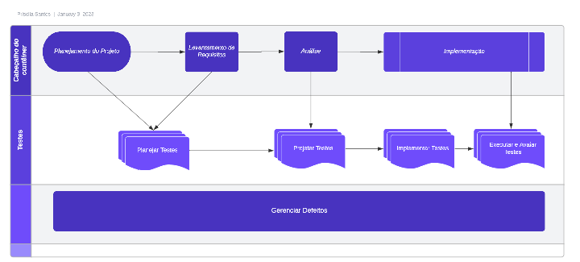
    
- No fluxo de trabalho do Jira fiz um fluxo para cada time, design, desenvolvimento, teste e deploy, cada um possui dois status, em andamento e done, com regra para que somente eu troque para finalizado.

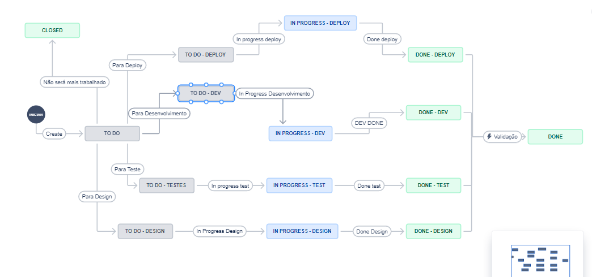

imagem do meu fluxo de trabalho no JIRA

- Nas colunas do painel foram colocados:
    - Closed - para itens que foram analisados mas não serão trabalhados (sugestão da professora);
    - Não iniciado - na qual os itens serão distribuídos entre as colunas "design", "desenvolvimento", "testes", "deploy", "concluído";
    - Desing;
    - Desenvolvimento;
    - Testes;
    - Deploy;
    - Concluído;
- User Stories
    - Documento em PDF:
        
        [User Stories.pdf](Imagens/User_Stories.pdf)
        
    - Tabela User Stories
        
        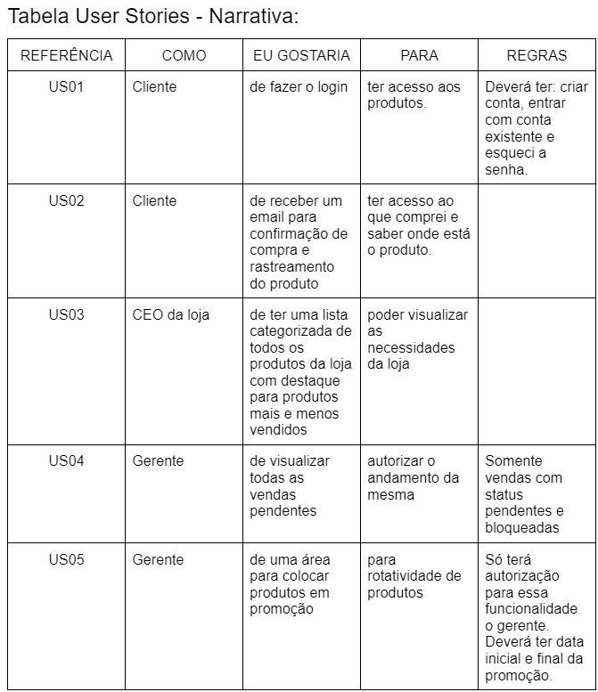
        
- Criação de User Stories no Jira:
    
    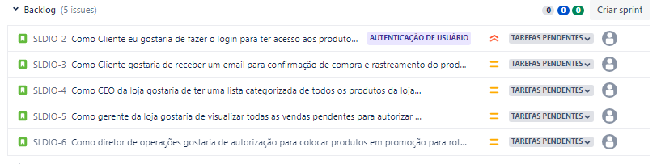
    
    - Descrição de User Stories:
        
        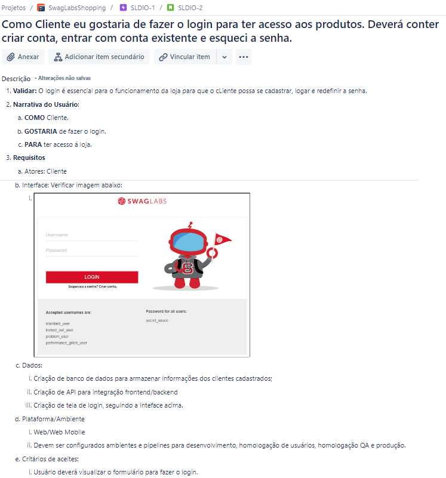
        
        NA interface do site para a adição de “Esqueceu a senha?” e “Criar conta” foi desenvolvida no FIGMA disponível em [https://www.figma.com/](https://www.figma.com/) .
        
- Criação de Roteiro no Jira:
    
    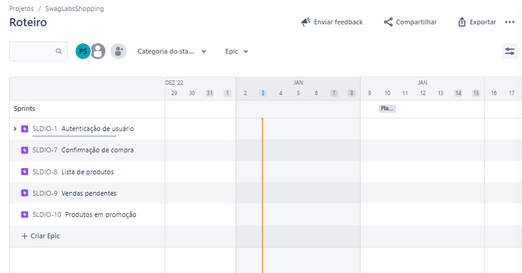
    
- Criação de casos de teste com o aplicativo “Zephyr Sacale”.

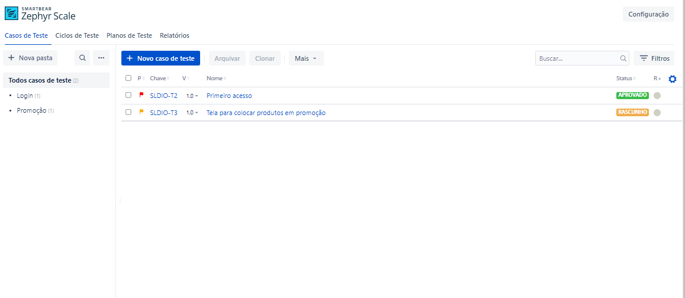

- Criação de Ciclos de teste com o aplicativo Zephyr.

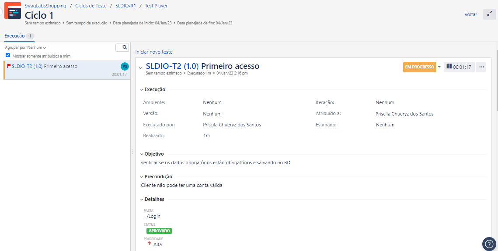

- Criação de uma issue no ciclo de teste onde ouve falha.

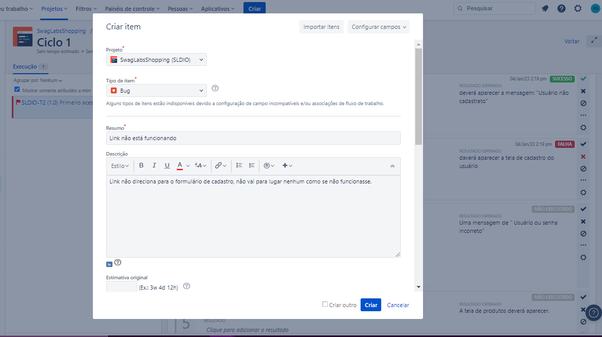

- Criação de um mind-map de uma user story
    
    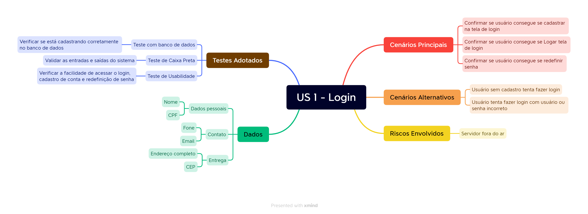
    
    - Anexado mind-map no user story correspondente
    
    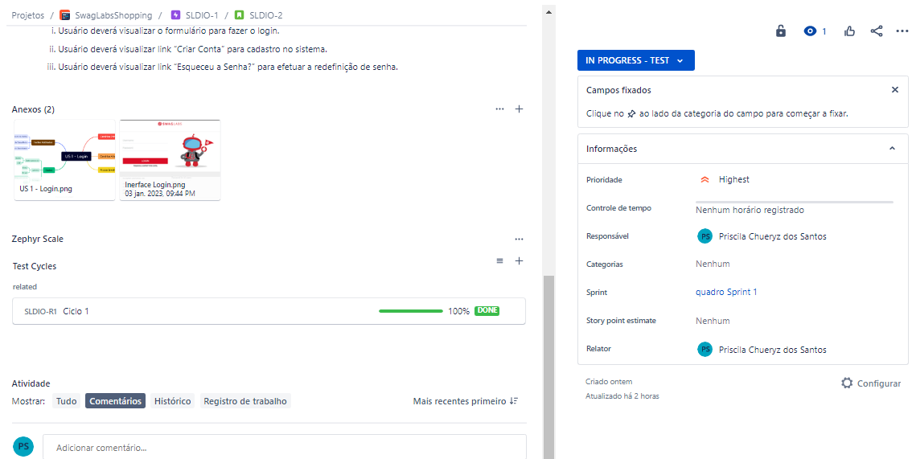
    
- Referências:

[https://artia.com/blog/sprint/](https://artia.com/blog/sprint/). Autor: Espinha, Roberto Gil. Última atualização em: 24|10|2022. Acessado em 03/01/2023.

[https://www.infoescola.com/engenharia-de-software/rup/](https://www.infoescola.com/engenharia-de-software/rup/)  . Autora: Martinez, Marina. Acessado em 04/01/2023.

Desenvolvimento Orientado por Comportamento.  Dev Media. Acesso: [https://www.devmedia.com.br/desenvolvimento-orientado-por-comportamento-bdd/21127](https://www.devmedia.com.br/desenvolvimento-orientado-por-comportamento-bdd/21127). Acessado em 03/01/2023
